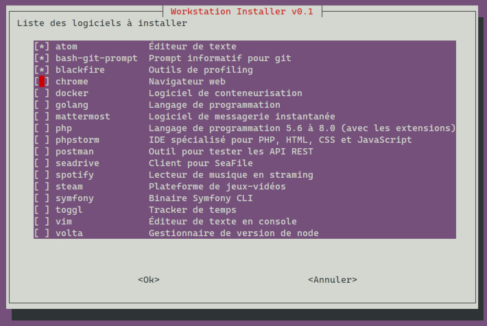

# workstation-installation

Script bash d'installation d'une nouvelle machine sous Linux, type Ubuntu.

## HOWTO
1. Récupérer le script

    * Avec `curl` : `curl -so workstation-installation.sh https://raw.githubusercontent.com/DjLeChuck/workstation-installation/main/workstation-installation.sh`
    * Avec `wget` : `wget -qO workstation-installation.sh https://raw.githubusercontent.com/DjLeChuck/workstation-installation/main/workstation-installation.sh`

1. L'exécuter via `sudo` : `sudo bash workstation-installation.sh`

1. Cocher les logiciels à installer avec la touche `Espace` puis valide via la touche `Entrée`

    

1. Laisser faire et aller se chercher un café ☕
